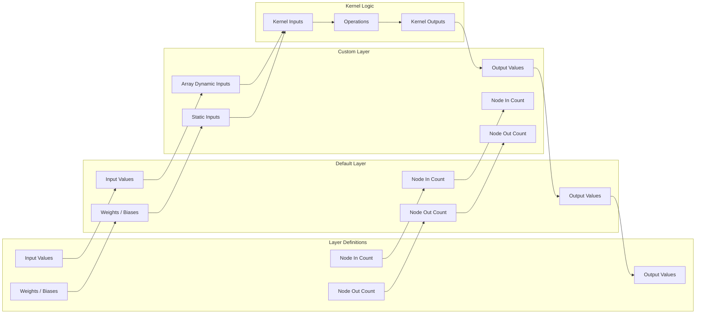

# 🦠 MycoNet
> **Disclaimer:** This project is still in development and may break or behave unexpectedly. Use at your own risk!

## Index
- [Myconet Module](#module)
- [Save File Format](#file-formats)


## 🚧 Roadmap
- [X] Basic network support
- [X] Dense Layer Support
- [ ] Convoluted Layer Support
- [ ] Convoluted Forward Support
- [ ] Convoluted Backward Support
- [X] File API v1.3
- [ ] Stable Network v2.4

## Relationship Graph



## Module

### Overview

MycoNet is a neural networking tool with integrated GPU acceleration using OpenCL 2.0, Allowing it to run quickly on many devices, including AMD and NVIDIA cards!
MycoNet is a tool produced to train and process neural networks for my Find-A-Bac project, Where I aim to help detect mycobacterium in animal tissue using AI.

> **Disclaimer:** As of 14/06/25 | Only tested on a AMD 7600 XT & Radeon 610M (Not that the 610M was very happy)
>
> **Disclaimer 2:** Support is not guaranteed, contact me if you are having problems.

### Features

- Custom Network Support
- Convoluted Layer Suport
- Backpropagation Support
- Multiple Optimizers
- Custom Logging (With Levels)

### Examples (OUT OF DATE)

```python
from myconet.layer.fully_connected import FullyConnected
from myconet.layer.convoluted import Convoluted
from myconet.network import Network

#  As of 14/06/25, There is not yet a activations class / list
#  Only ReLU & Sigmoid are currently supported (With room to expand)

net = Network((
    Convoluted((100, 100, 3), (5, 5), 2, 1),  # ReLU
    FullyConnected(2304, 1, 2),  # Sigmoid
), log_level=2)

net.save("my_neural_network.pyn")
net.release()  # Remove all buffers (And stop logger)

```

```python
from myconet.network import Network

net = Network.load("my_neural_network.pyn")

outputs = net.forward(input_data: np.ndarray)

net.release()

```

### 🛠️ Installation

Ensure requrements are met:
- Python 3.12
- OpenCL 2.0

Pip requirements:
- pyopencl
- openslide
- numpy

> **Warning:** This list may not be exhaustive, as project is still in development

## File Formats

### Network Files (.pyn) (v1.2)

> **Warning:** This file format implemintation is _INCOMPLETE_

#### File API
Everything is writen to a file through the FileAPI, It turns python datatypes into bytes and stores them.
The API Supports a wide range of datatypes including (But not limited to): Ints, Floats, Bools, NoneTypes, Strings, Bytes, Lists, Tuples, Dicts, NDarrays

##### Type Lookup
Here is a list of some data types along with there: (Data Type ID, Encode Function, Decode Function)
```python
type_lookup = {
    int: (0, encode_number, decode_int),
    str: (1, encode_str, decode_str),
    float: (2, encode_float, decode_float),
    bool: (3, encode_bool, decode_bool),
    type(None): (4, encode_none, decode_none),
    bytes: (5, encode_bytes, decode_bytes),
    dict: (6, None, None),  # Handled seperatly
    np.ndarray: (7, encode_ndarray, decode_ndarray),
    list: (8, encode_list, decode_list),
    tuple: (9, encode_tuple, decode_tuple),
}

```
##### Encoding / Decoding
All the encoding specifications, A DataType in [DATATYPE] is refering to anouther data type in the list.

|   DataType   |  Infomation | 
| :--: | :--  |
| Int | uint64, Little Enderian (8 Bytes) |
| Float | IEEE-754 32-bit format (struct -> fmt="f") |
| Bytes | [Int], Bytes |
| String | [Int], Encoded "utf-8" string as [Bytes] |
| NoneType | Single UTF-8 Encoded "N" |
| Boolean | uint8, Little Endarian, 1 For True, 0 for False |
| List | Converted to a [Dict] where each key is the index, and value the element |
| Tuple | Converted to a [Dict] where each key is the index, and value the element |
| Dict | Key-Item pair count [Int], Key ID (From lookup) [Int], Item ID (From lookup) [Int], [type(Key)], [type(item)] |
| Numpy.ndarray | Shape [Tuple], dType [String], ndarray.toBytes() [Bytes] (Is lz4 Compressed if specified) |


> More infomation can be found in the file_api.py file if required

#### File Header
This section contains basic infomation about the file, including its version / layer types.

Data Layout (In Order):
|   Name / Usage   | Data Type | Size (Bytes) |
| :--------------- | :------:  | :---------:  |
| Module Version (Major)  | uint - Little         |  1   |
| Module Version (Minor)  | uint - Little         |  1   |
| File Version (Major)    | uint - Little         |  1   |
| File Version (Minor)    | uint - Little         |  1   |
| Flags                   | uint - Little         |  1   |
| Layer Types             | uint - Little         |  8   |
| Creation Date           | uint - Little         |  8   |
| Optimiser ID            | uint - Little         |  1   |
| Layer Count             | uint - Little         |  8   |


#### Header Flags
Each bit in the flags is a setting / config option

Bits are from left to right (Big Enderian?)
|   Bit   |  Setting | 
| :--: | :--  |
| 0 | Is Compressed? |
| 1 | Not Used |  
| 2 | Not Used |  
| 3 | Not Used |  
| 4 | Not Used |  
| 5 | Not Used |  
| 6 | Not Used |  
| 7 | Not Used |  


#### File Body
This is a section containing a list of all network layers stored in order (Input to Output).
The values are stored one after the other in the file.
> **NOTE:** The first "Dictionary" Data Type does NOT have a "6" in front to signifiy that its a dict.

Single Layers Data:
|   Name / Usage   | Data Type | Size (Bytes) |
| :--------------- | :------:  | :---------:  |
| Layer Data               | Dictionary          |  N/A  |


#### Layers
All Layers store their data in a encoded dictionary for consistency. This dictionary may have been lz4 compressed,
depending on the is_compressed flag stored in the header.


##### Fully Populated
```python
{
    "*layer_name*": (string) The name of the layer class -> "FullyPopulated"
    "input_size" : (int) Number of input nodes,
    "output_size" : (int) Number of output nodes,
    "activation" : (int) The Activation ID,

    "weights": (numpy.ndarray) Flattened 2D array of layers weights,
    "biases" : (numpy.ndarray) 1D array of layers biases,
}
```

#### Optimisers
If the optimiser ID Loaded earlier is 0, there is no data here, and no optimiser has been set for the network.
If the optimiser ID is not 0 (Likely 1), there is now optimiser data, stored in an encoded dictionary.
Once again, the dictionary may be compressed depending on what is_compressed flag value is set.

|   Name / Usage   | Data Type | Size (Bytes) |
| :--------------- | :------:  | :---------:  |
| Optimiser Data               | Dictionary          |  N/A  |

The Data within the dictionary is set out like this:

```python
{
    "*optimiser_name*": (string) The name of the optimiser class -> e.g. "Standard"

    ...
    Optimiser Data, dependant on the optimiser, is handled on a per-class basis.
    ...
}
```


### Training Data Cache (.bin)
This file format stores serialized training samples for quick loading.
All data is LZ4-compressed as a sequence of byte-length pairs, followed by raw data bytes.

#### File Body

Each training sample is written in order, containing both the input data and the expected output.
The structure repeats for every sample until the end of file.

Single Sample Data (In Order):

| Name / Usage| Data Type | Size (Bytes) |
| :-- | :--: | :--: |
| Input Length	     | Int - Little | 32 |
| Input Bytes        | Byte Array	| Input Length |
| Output Length      | Int - Little	| 32|
| Output Bytes	     | Byte Array	| Output Length |

#### Notes

- Length Prefix: All data arrays are prefixed with their size, stored as a 32-byte little-endian integer.
- Input Data: Serialized numpy.ndarray (default: float32, shape (100, 100, 3)).
- Output Data: Serialized numpy.ndarray (default: float32, shape depends on task).
- Compression: Entire file is transparently compressed using lz4.frame.
- Termination: End of file is reached when no further length prefix can be read.


## About Me

This project is maintained by [Daniel Dobromylskyj](https://github.com/DanielDobromylskyj). You can reach me at daniel.dobromylskyj@outlook.com.


## 📝 License

[Apache](LICENSE)
